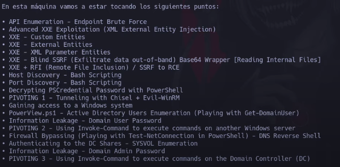
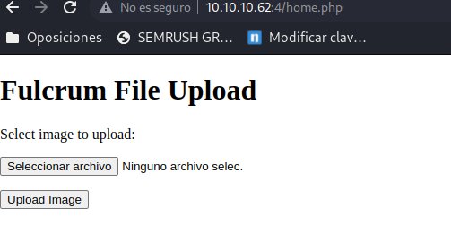

- #Author: José Luis Íñigo
- #Nickname: Riskoo
- #Bibliographical sources: S4vitar 
- #Machine Fulcrum Hack the box


1º Vemos la conexión con un ping, vemos que existe y es linux
2º Vamos a ver los puertos abiertos

```bash
sudo nmap -p- --open -sS --min-rate 5000 -vvv -n -Pn 10.10.10.62 -oG allports

Host discovery disabled (-Pn). All addresses will be marked 'up' and scan times may be slower.
Starting Nmap 7.92 ( https://nmap.org ) at 2022-06-23 09:14 CEST
Initiating SYN Stealth Scan at 09:14
Scanning 10.10.10.62 [65535 ports]
Discovered open port 22/tcp on 10.10.10.62
Discovered open port 80/tcp on 10.10.10.62
Discovered open port 88/tcp on 10.10.10.62
Discovered open port 4/tcp on 10.10.10.62
Discovered open port 9999/tcp on 10.10.10.62
Discovered open port 56423/tcp on 10.10.10.62
Completed SYN Stealth Scan at 09:15, 17.93s elapsed (65535 total ports)
Nmap scan report for 10.10.10.62
Host is up, received user-set (0.094s latency).
Scanned at 2022-06-23 09:14:55 CEST for 18s
Not shown: 65498 closed tcp ports (reset), 31 filtered tcp ports (no-response)
Some closed ports may be reported as filtered due to --defeat-rst-ratelimit
PORT      STATE SERVICE      REASON
4/tcp     open  unknown      syn-ack ttl 63
22/tcp    open  ssh          syn-ack ttl 63
80/tcp    open  http         syn-ack ttl 63
88/tcp    open  kerberos-sec syn-ack ttl 63
9999/tcp  open  abyss        syn-ack ttl 63
56423/tcp open  unknown      syn-ack ttl 63

Read data files from: /usr/bin/../share/nmap
Nmap done: 1 IP address (1 host up) scanned in 18.07 seconds
           Raw packets sent: 89388 (3.933MB) | Rcvd: 81095 (3.244MB)
```
3º Una vez que vemos que los puertos abiertos son 4,22,80,88,9999,56423 vamos a inspeccionarlos

```bash
nmap -sCV -p4,22,80,88,9999,56423 10.10.10.62 -oN Targeted
Starting Nmap 7.92 ( https://nmap.org ) at 2022-06-23 09:17 CEST
Nmap scan report for 10.10.10.62
Host is up (0.052s latency).

PORT      STATE SERVICE VERSION
4/tcp     open  http    nginx 1.18.0 (Ubuntu)
|_http-title: Site doesn't have a title (text/html; charset=UTF-8).
|_http-server-header: nginx/1.18.0 (Ubuntu)
22/tcp    open  ssh     OpenSSH 8.2p1 Ubuntu 4ubuntu0.2 (Ubuntu Linux; protocol 2.0)
| ssh-hostkey: 
|   3072 48:ad:d5:b8:3a:9f:bc:be:f7:e8:20:1e:f6:bf:de:ae (RSA)
|   256 b7:89:6c:0b:20:ed:49:b2:c1:86:7c:29:92:74:1c:1f (ECDSA)
|_  256 18:cd:9d:08:a6:21:a8:b8:b6:f7:9f:8d:40:51:54:fb (ED25519)
80/tcp    open  http    nginx 1.18.0 (Ubuntu)
|_http-title: Input string was not in a correct format.
| http-methods: 
|_  Potentially risky methods: TRACE
|_http-server-header: nginx/1.18.0 (Ubuntu)
88/tcp    open  http    nginx 1.18.0 (Ubuntu)
|_http-title: phpMyAdmin
| http-robots.txt: 1 disallowed entry 
|_/
|_http-server-header: nginx/1.18.0 (Ubuntu)
9999/tcp  open  http    nginx 1.18.0 (Ubuntu)
|_http-title: Input string was not in a correct format.
| http-methods: 
|_  Potentially risky methods: TRACE
|_http-server-header: nginx/1.18.0 (Ubuntu)
56423/tcp open  http    nginx 1.18.0 (Ubuntu)
|_http-title: Site doesn't have a title (application/json;charset=utf-8).
|_http-server-header: Fulcrum-API Beta
Service Info: OS: Linux; CPE: cpe:/o:linux:linux_kernel

Service detection performed. Please report any incorrect results at https://nmap.org/submit/ .
Nmap done: 1 IP address (1 host up) scanned in 29.01 seconds

```

## What web
Vamos a ver que nos dice whatweb de los diferentes puertos

```bash
┌──(riskoo㉿kali)-[~/Riskoo/knowhowhack/docs/12-Ataques a máquinas/maquinahtb/htb fulcrum machine/Report]
└─$ for port in 4 22 80 88 9999 56423;do echo -e "\n [!] Escaneando la web http://10.10.10.62:$port";whatweb http://10.10.10.62:$port;done                                                                                                                                                     

 [!] Escaneando la web http://10.10.10.62:4
http://10.10.10.62:4 [200 OK] Country[RESERVED][ZZ], HTTPServer[Ubuntu Linux][nginx/1.18.0 (Ubuntu)], IP[10.10.10.62], nginx[1.18.0]

 [!] Escaneando la web http://10.10.10.62:22
ERROR Opening: http://10.10.10.62:22 - uninitialized constant #<Class:ExtendedHTTPResponse>::HTTPBadResponse

 [!] Escaneando la web http://10.10.10.62:80
http://10.10.10.62:80 [200 OK] ASP_NET[Verbose error messages], Country[RESERVED][ZZ], HTTPServer[Ubuntu Linux][nginx/1.18.0 (Ubuntu)], IP[10.10.10.62], Title[Input string was not in a correct format.], nginx[1.18.0]

 [!] Escaneando la web http://10.10.10.62:88
http://10.10.10.62:88 [200 OK] Content-Security-Policy[default-src 'self' ;options inline-script eval-script;referrer no-referrer;img-src 'self' data:  *.tile.openstreetmap.org;,default-src 'self' ;script-src 'self'  'unsafe-inline' 'unsafe-eval';referrer no-referrer;style-src 'self' 'unsafe-inline' ;img-src 'self' data:  *.tile.openstreetmap.org;], Cookies[phpMyAdmin,pmaCookieVer,pma_collation_connection,pma_lang], Country[RESERVED][ZZ], HTML5, HTTPServer[Ubuntu Linux][nginx/1.18.0 (Ubuntu)], HttpOnly[phpMyAdmin,pmaCookieVer,pma_collation_connection,pma_lang], IP[10.10.10.62], JQuery, PasswordField[pma_password], Script[text/javascript], Title[phpMyAdmin], UncommonHeaders[x-ob_mode,referrer-policy,content-security-policy,x-content-security-policy,x-webkit-csp,x-content-type-options,x-permitted-cross-domain-policies,x-robots-tag], X-Frame-Options[DENY], X-UA-Compatible[IE=Edge], X-XSS-Protection[1; mode=block], nginx[1.18.0], phpMyAdmin[4.7.4]

 [!] Escaneando la web http://10.10.10.62:9999
http://10.10.10.62:9999 [200 OK] ASP_NET[Verbose error messages], Country[RESERVED][ZZ], HTTPServer[Ubuntu Linux][nginx/1.18.0 (Ubuntu)], IP[10.10.10.62], Title[Input string was not in a correct format.], nginx[1.18.0]

 [!] Escaneando la web http://10.10.10.62:56423
http://10.10.10.62:56423 [200 OK] Country[RESERVED][ZZ], HTTPServer[Fulcrum-API Beta], IP[10.10.10.62]

```

## Ante que estamos

Tenemos varios servicios webs phpmyadmin, un asp.net, una web bajo mantenimiento que tiene un index.php y otra aplicación que nos devuelve un xml

Voy a apostar a que está la opción dentro del servicio xml ya que aparte básicamente en las instrucciones viene, pero voy a intentar hacer antes un fuzzing a la página web por el puerto 4 por probar.

## 10.10.10.64

feroxbuster -u http://10.10.10.62:4 -x php                                                                                          

```bash
 ___  ___  __   __     __      __         __   ___
|__  |__  |__) |__) | /  `    /  \ \_/ | |  \ |__
|    |___ |  \ |  \ | \__,    \__/ / \ | |__/ |___
by Ben "epi" Risher 🤓                 ver: 2.7.0
───────────────────────────┬──────────────────────
 🎯  Target Url            │ http://10.10.10.62:4
 🚀  Threads               │ 50
 📖  Wordlist              │ /usr/share/seclists/Discovery/Web-Content/raft-medium-directories.txt
 👌  Status Codes          │ [200, 204, 301, 302, 307, 308, 401, 403, 405, 500]
 💥  Timeout (secs)        │ 7
 🦡  User-Agent            │ feroxbuster/2.7.0
 💉  Config File           │ /etc/feroxbuster/ferox-config.toml
 💲  Extensions            │ [php]
 🏁  HTTP methods          │ [GET]
 🔃  Recursion Depth       │ 4
 🎉  New Version Available │ https://github.com/epi052/feroxbuster/releases/latest
───────────────────────────┴──────────────────────
 🏁  Press [ENTER] to use the Scan Management Menu™
──────────────────────────────────────────────────
200      GET        1l        6w        0c http://10.10.10.62:4/
200      GET       13l       27w        0c http://10.10.10.62:4/home.php
200      GET        1l        6w        0c http://10.10.10.62:4/index.php
200      GET        1l        6w        0c http://10.10.10.62:4/upload.php
[####################] - 1m    120000/120000  0s      found:4       errors:0      
[####################] - 1m     60000/60000   570/s   http://10.10.10.62:4 
[####################] - 1m     60000/60000   570/s   http://10.10.10.62:4/ 

```

Vemos que tenemos un index. un home y un upload que a lo mejor nos deja subir alguna imagen, voy a analizar por burpsuite

El php que más me ha llamado la atención por nombre es el upload.php , me sale un mensaje como que no ha sido posible subir archivo. He intentado ver por burpsuite pero aun poniendo algunos parámetros random nada interesante que encontrar en poco tiempo. Ha sido un fallo porque despúes he mirado home.php y tiene la opción de subir archivo jaja, así que nada voy a analizar



Después de analizar la subida, diferentes wraper, transversal nada de momento.

## Los demás
A excepción de http://10.10.10.62:56423 es un phpmyadmin que con contraseñas básicas no funciona y unos errores de una aplicación de .net funcionando a través de ngix. Como dijimos nos vamos a decantar por la aplicación de xml

## http://10.10.10.62:56423


https://youtu.be/O8-l2KNeRkM?t=5269