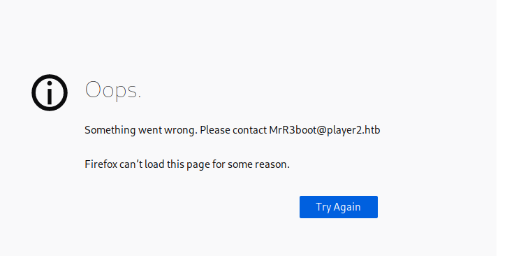
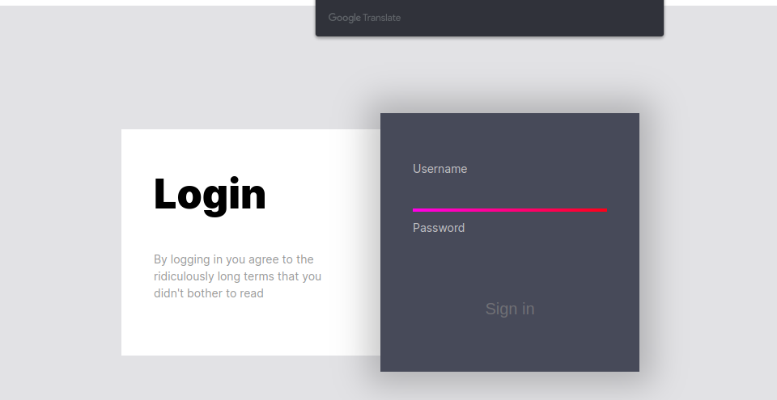
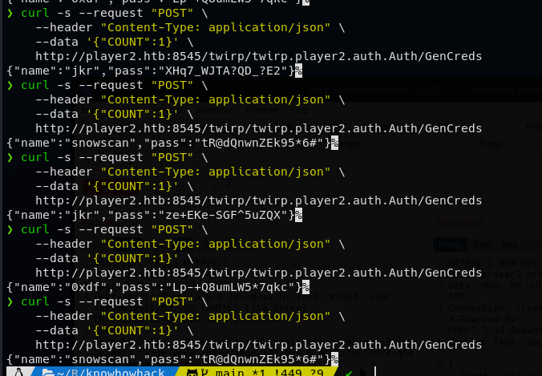
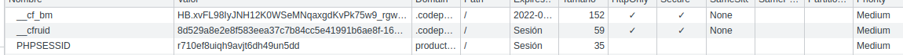
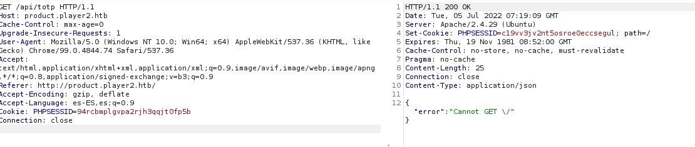
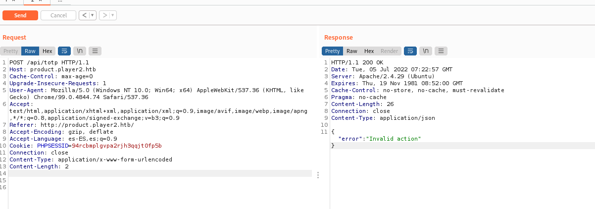
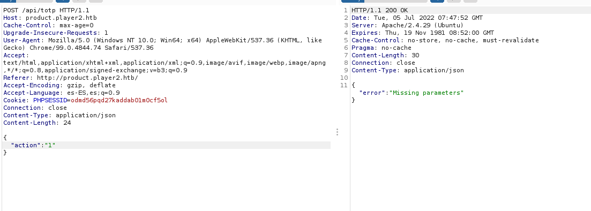
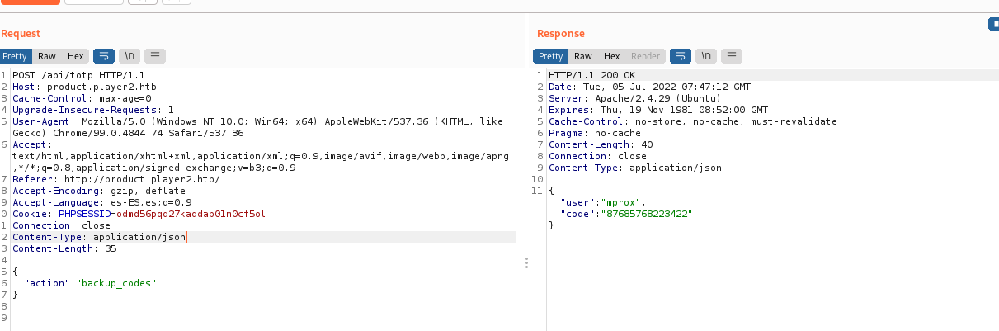
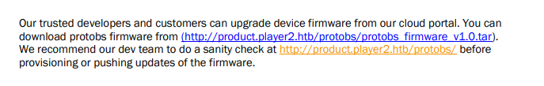
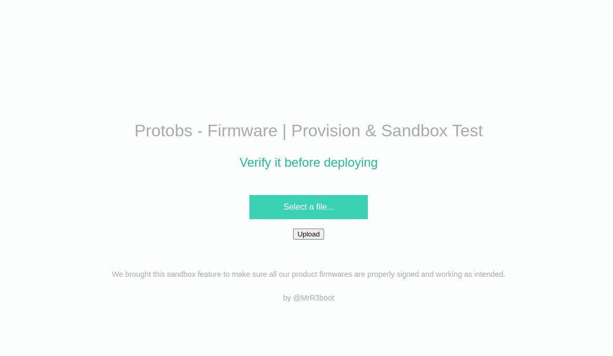

## Máquina PLAYERTWO HTB


- #Author: José Luis Íñigo
- #Nickname: Riskoo
- #Machine Playertwo Hack the box
-  Subdomain Enumeration JWT Enumeration Information Leakage - Abusing No Redirect Playing with BFAC (Backup File Artifacts Checker) in order to find a configuration file PHP Source Code Analysis Forge JWT Abusing ffmpeg AVI Exploit in order to read internal files Escaping Limited Shell - OpenSSH 7.2p1 (Authenticated) XAuth Command Injection Abusing Codiad IDE in order to execute commands (RCE - www-data) Abusing Cron Job (Privilege Escalation)
-  InsaneExternalOTPPHPPenetration Tester Level 3Information DisclosureA04:2021-Insecure DesignEnumerationCustomPythonMisconfigurationA05:2021-Security MisconfigurationReversingELFBrute Force AttackWeb Site Structure DiscoveryAPI AbuseWeb APIsPHP Type JugglingAuthenticationSUID ExploitationHeap ExploitationBinary ExploitationPort ForwardingDomain ReconaisanceTunnelingExploit DevelopmentLateral Movement
- style eWPT OSWE OSCP (Escalada)

ip 10.10.10.170
Mi ip 10.10.14.10

## Hacemos un ping 
Vemos que tenemos conexión ttl 63 por lo que es un linux

## Miramos los puertos abiertos

```bash
sudo nmap -p- --open -sS --min-rate 5000 -vvv -n -Pn 10.10.10.170 -oG allports

PORT     STATE SERVICE REASON
22/tcp   open  ssh     syn-ack ttl 63
80/tcp   open  http    syn-ack ttl 63
8545/tcp open  unknown syn-ack ttl 63

```

## Miramos los servicios 

```bash
nmap -sC -sV -p22,80,8545 10.10.10.170 -oN targeted

22/tcp   open  ssh     OpenSSH 7.6p1 Ubuntu 4ubuntu0.3 (Ubuntu Linux; protocol 2.0)
| ssh-hostkey: 
|   2048 0e:7b:11:2c:5e:61:04:6b:e8:1c:bb:47:b8:4d:fe:5a (RSA)
|   256 18:a0:87:56:64:06:17:56:4d:6a:8c:79:4b:61:56:90 (ECDSA)
|_  256 b6:4b:fc:e9:62:08:5a:60:e0:43:69:af:29:b3:27:14 (ED25519)
80/tcp   open  http    Apache httpd 2.4.29 ((Ubuntu))
|_http-server-header: Apache/2.4.29 (Ubuntu)
|_http-title: Site doesn't have a title (text/html).
8545/tcp open  http    (PHP 7.2.24-0ubuntu0.18.04.1)
|_http-title: Site doesn't have a title (application/json).
| fingerprint-strings: 
|   FourOhFourRequest: 
|     HTTP/1.1 404 Not Found
|     Date: Mon, 04 Jul 2022 14:45:14 GMT
|     Connection: close
|     X-Powered-By: PHP/7.2.24-0ubuntu0.18.04.1
|     Content-Type: application/json
|     {"code":"bad_route","msg":"no handler for path "/nice%20ports%2C/Tri%6Eity.txt%2ebak"","meta":{"twirp_invalid_route":"GET /nice%20ports%2C/Tri%6Eity.txt%2ebak"}}
|   GetRequest: 
|     HTTP/1.1 404 Not Found
|     Date: Mon, 04 Jul 2022 14:45:06 GMT
|     Connection: close
|     X-Powered-By: PHP/7.2.24-0ubuntu0.18.04.1
|     Content-Type: application/json
|     {"code":"bad_route","msg":"no handler for path "/"","meta":{"twirp_invalid_route":"GET /"}}
|   HTTPOptions: 
|     HTTP/1.1 404 Not Found
|     Date: Mon, 04 Jul 2022 14:45:06 GMT
|     Connection: close
|     X-Powered-By: PHP/7.2.24-0ubuntu0.18.04.1
|     Content-Type: application/json
|     {"code":"bad_route","msg":"no handler for path "/"","meta":{"twirp_invalid_route":"OPTIONS /"}}
|   OfficeScan: 
|     HTTP/1.1 404 Not Found
|     Date: Mon, 04 Jul 2022 14:45:14 GMT
|     Connection: close
|     X-Powered-By: PHP/7.2.24-0ubuntu0.18.04.1
|     Content-Type: application/json
|_    {"code":"bad_route","msg":"no handler for path "/"","meta":{"twirp_invalid_route":"GET /"}}

```

## Miramos que contienen

### Puerto 80

>Localizamos un usuario y un dominio 
>user: MrR3boot
>domain: player2.htb



Se está ejecutando un ngix

#### Puerto 8545
```bash
{"code":"bad_route","msg":"no handler for path \"\/\"","meta":{"twirp_invalid_route":"GET \/"}}
```

## Fuzzing
Vamos a tirar inicialmente por el puerto 8545

Añadimos a /etc/hosts  10.10.10.170 player2.htb

Vamos a buscar primero subdominios 
```bash
#buscamos subdominios

gobuster vhost -u http://player2.htb -w /home/riskoo/Riskoo/maquinas/diccionarios/SecLists/Discovery/DNS/subdomains-top1million-5000.txt -t 200

Found: gc._msdcs.player2.htb (Status: 400) [Size: 442]
Found: product.player2.htb (Status: 200) [Size: 5063]


```

## Añadimos a hosts el subdominio

En etc/hosts añadimos el subdominio
```bash
10.10.10.170 product.player2.htb
10.10.10.170 gc._msdcs.player2.htb
```
Volvemos a hacer gobuster pero sale lo mismo, lo que si ahora podemos entrar en product.player2.htb cosa que antes no.




## que es twirp
Vimos que cuando entrábamos por el puerto 8545 nos devolvía {"twirp_invalid_route":"GET \/"}}

>TWRP cuenta con la opción Install, que permite flashear archivos . ZIP. Esto es lo que habilita la opción de instalar MODs, ROMs y custom kernels, así como aplicaciones empaquetadas. Ofrece también la opción Backup, orientada a hacer fácil y rápidamente copias de seguridad de la memoria NAND.


## Que es proto?
Buscando en google twirp exploit he encontrado https://developers.google.com/protocol-buffers/docs/proto3 que usa un .proto . Hemos visto una carpeta llamada proto por lo que 


## Fuzzing

```bash
Ferobuxter -u http://player2.htb
200      GET      133l      554w     6184c http://player2.htb/
301      GET        9l       28w      311c http://player2.htb/assets => http://player2.htb/assets/
301      GET        9l       28w      314c http://player2.htb/assets/js => http://player2.htb/assets/js/
200      GET        1l       14w      113c http://player2.htb/mail
200      GET      133l      554w     6184c http://player2.htb/index
301      GET        9l       28w      311c http://player2.htb/images => http://player2.htb/images/
301      GET        9l       28w      318c http://player2.htb/images/thumbs => http://player2.htb/images/thumbs/
301      GET        9l       28w      308c http://player2.htb/src => http://player2.htb/src/
301      GET        9l       28w      315c http://player2.htb/assets/css => http://player2.htb/assets/css/
301      GET        9l       28w      311c http://player2.htb/vendor => http://player2.htb/vendor/
301      GET        9l       28w      318c http://player2.htb/vendor/google => http://player2.htb/vendor/google/
301      GET        9l       28w      322c http://player2.htb/assets/css/images => http://player2.htb/assets/css/images/
403      GET        9l       28w      276c http://player2.htb/server-status
301      GET        9l       28w      310c http://player2.htb/proto => http://player2.htb/proto/
301      GET        9l       28w      314c http://player2.htb/generated => http://player2.htb/generated/
500      GET        0l        0w        0c http://player2.htb/src/Auth
200      GET        0l        0w        0c http://player2.htb/vendor/autoload
```


## Buscamos directorios

```bash
#Buscamos php

gobuster dir -u http://product.player2.htb -w ../diccionarios/SecLists/Discovery/Web-Content/directory-list-2.3-medium.txt -x php -t 200 

/index                (Status: 200) [Size: 5063]
/index.php            (Status: 200) [Size: 5063]
/assets               (Status: 301) [Size: 327] [--> http://product.player2.htb/assets/]
/images               (Status: 301) [Size: 327] [--> http://product.player2.htb/images/]
/home.php             (Status: 302) [Size: 0] [--> index]                               
/home                 (Status: 302) [Size: 0] [--> index]                               
/api                  (Status: 301) [Size: 324] [--> http://product.player2.htb/api/]  
/conn                 (Status: 200) [Size: 0]                                           
/conn.php             (Status: 200) [Size: 0] 
/server-status        (Status: 403) [Size: 284]            
```

## buscamos .proto

```bash
#bajamos los hilos a 40 porque 200 da problemas
gobuster dir -u http://player2.htb/proto -w ../Discovery/Web-Content/directory-list-2.3-medium.txt -x proto -t 40 

/generated.proto      (Status: 200) [Size: 266]
```
visitamos la web http://player2.htb/proto/generated.proto  y nos devuelve esto

```bash python
syntax = "proto3";

package twirp.player2.auth;
option go_package = "auth";

service Auth {
  rpc GenCreds(Number) returns (Creds);
}

message Number {
  int32 count = 1; // must be > 0
}

message Creds {
  int32 count = 1;
  string name = 2; 
  string pass = 3; 
}
```

Suponemos que /twirp existe porque cuando ponemos el curl no nos manda un 404
```bash
curl http://player2.htb:8545/twirp
{"code":"bad_route","msg":"no handler for path \"\/twirp\"","meta":{"twirp_invalid_route":"GET \/twirp"}}
``` 

De momento no podemos hacer nada... sigo leyendo twirp a ver que encuentro. Hay en el menú una sección curl que nos devuelve

```bash
curl --request "POST" \
    --header "Content-Type: application/json" \
    --data '{"subject": "World"}' \
    http://localhost:8080/twirp/example.helloworld.HelloWorld/Hello
```

También he visto lo siguiente
```bash
Protobuf
Use the header Content-Type: application/protobuf to signal that the request and response are Protobuf. Use the protoc tool to encode and decode the Protobuf messages into readable key-values:

echo 'subject:"World"' \
    | protoc --encode example.helloworld.HelloReq ./rpc/helloworld/service.proto \
    | curl -s --request POST \
      --header "Content-Type: application/protobuf" \
      --data-binary @- \
      http://localhost:8080/twirp/example.helloworld.HelloWorld/Hello \
    | protoc --decode example.helloworld.HelloResp ./rpc/haberdasher/service.proto
```
Parece que lo guarda en un .proto que seguramente sea el que hemos encontrado antes. generated.proto

En https://twitchtv.github.io/twirp/docs/spec_v5.html vemos que haciendo un post también se puede conseguir algo

```bash
URL ::= Base-URL "/twirp/" [ Package "." ] Service "/" Method
```
o

```bash
curl --request "POST" \
     --location "http://localhost:8080/twirp/[package].[service]/[rpc]" \
     --header "Content-Type:application/json" \
     --data '{"[key for input message]": [value]}'
```
según el código que vimos antes
```bash

package twirp.player2.auth;
option go_package = "auth";

service Auth {
  rpc GenCreds(Number) returns (Creds);
}

message Number {
  int32 count = 1; // must be > 0
}

```
La url debería de ser algo así
package twirp.player2.auth
service Suth
método GenCreds
message count=1


> No olvidar que iba por el puerto 8545 en vez del 8080 como aparece arriba

sería algo así como:

```bash
http://player2.htb:8545/twirp/twirp.player2.auth.Auth/GenCreds

curl -s --request "POST" \
    --header "Content-Type: application/json" \
    --data '{"COUNT":1}' \
    http://player2.htb:8545/twirp/twirp.player2.auth.Auth/GenCreds

#Nos devuelve

{"name":"jkr","pass":"ze+EKe-SGF^5uZQX"}%         
```
Siempre que encuentro una clave intento hacer ssh... pero en este caso nanai 

```bash
ssh jkr@player2.htb
```
Despues de estar má de una hora buscando he vuelto a hacer el curl y ohhh, distinto nombre y clave


{"name":"0xdf","pass":"tR@dQnwnZEk95*6#"}%  



Aparecen diferentes usuario y contraseña pero se vuelven a repetir por lo que parece que habrá un número limitado.

```bash
{"name":"0xdf","pass":"Lp-+Q8umLW5*7qkc"}%

{"name":"mprox","pass":"ze+EKe-SGF^5uZQX"}%          

{"name":"snowscan","pass":"ze+EKe-SGF^5uZQX"}

{"name":"jkr","pass":"ze+EKe-SGF^5uZQX"}%  

{"name":"snowscan","pass":"XHq7_WJTA?QD_?E2"}


```
Parece que hay diferentes usuarios que aparecen los mismos con diferentes claves p

>El comando tee guarda credenciales únicas de todas formas pondré un -u para que solo salgan las únicas
También le vamos a decir cuantas únicas hay.
```bash
for i in {1..500}; do 
curl -s -X POST -H "Content-Type:application/json" -d '{"number": 1}' http://player2.htb:8545/twirp/twirp.player2.auth.Auth/GenCreds;echo;done | sort -u | tee creds.json | wc -l > claves

```
Nos aparece que hay 16

```bash
{"name":"0xdf","pass":"Lp-+Q8umLW5*7qkc"}
{"name":"0xdf","pass":"tR@dQnwnZEk95*6#"}
{"name":"0xdf","pass":"XHq7_WJTA?QD_?E2"}
{"name":"0xdf","pass":"ze+EKe-SGF^5uZQX"}
{"name":"jkr","pass":"Lp-+Q8umLW5*7qkc"}
{"name":"jkr","pass":"tR@dQnwnZEk95*6#"}
{"name":"jkr","pass":"XHq7_WJTA?QD_?E2"}
{"name":"jkr","pass":"ze+EKe-SGF^5uZQX"}
{"name":"mprox","pass":"Lp-+Q8umLW5*7qkc"}
{"name":"mprox","pass":"tR@dQnwnZEk95*6#"}
{"name":"mprox","pass":"XHq7_WJTA?QD_?E2"}
{"name":"mprox","pass":"ze+EKe-SGF^5uZQX"}
{"name":"snowscan","pass":"Lp-+Q8umLW5*7qkc"}
{"name":"snowscan","pass":"tR@dQnwnZEk95*6#"}
{"name":"snowscan","pass":"XHq7_WJTA?QD_?E2"}
{"name":"snowscan","pass":"ze+EKe-SGF^5uZQX"}

```

Lo que me trae preocupado es que , por que va cambiando? parece que va cambiando con respecto a algún tiempo . Podría usar hydra y posiblemente funcione pero luego ... 

Tampoco son muchas las claves voy a probar y me funciona para mprox y la clave terminada en *6# pero tampoco hace mucho solo entra en una nueva url con /totp

```{"name":"mprox","pass":"tR@dQnwnZEk95*6#"}```

Mirándo el código veo que pone 
```bash
<div class="login">2FA</div>
<div class="eula">You can either use the OTP that we sent to your mobile or the backup codes that you have with you.</div>
```

También es interesante que arrastramos unas cookies 




Es curioso que antes se me pasara que viendo el código de la página , y como no conocía el tema , no me diese cuenta que el nombre de la página es Protobs | Portal

```bash
/api                  (Status: 301) [Size: 324] [--> http://product.player2.htb/api/]  
/conn                 (Status: 200) [Size: 0]  
```

Leyendo es hacktricks dice que que puede haber apis con versiones antiguas ... de manera totalmente random he probado /api/totp 



Me aparece que no acepta. get así que cambio a post



Vale me sale invalid action, voy a intentar mandarle algun tipo de json que ponga action y pondré también el application-Type json a ver.




```bash
POST /totp HTTP/1.1
Host: product.player2.htb
Content-Length: 32
Cache-Control: max-age=0
Upgrade-Insecure-Requests: 1
Origin: http://product.player2.htb
Content-Type: application/x-www-form-urlencoded
User-Agent: Mozilla/5.0 (Windows NT 10.0; Win64; x64) AppleWebKit/537.36 (KHTML, like Gecko) Chrome/99.0.4844.74 Safari/537.36
Accept: text/html,application/xhtml+xml,application/xml;q=0.9,image/avif,image/webp,image/apng,*/*;q=0.8,application/signed-exchange;v=b3;q=0.9
Referer: http://product.player2.htb/totp
Accept-Encoding: gzip, deflate
Accept-Language: es-ES,es;q=0.9
Cookie: PHPSESSID=odmd56pqd27kaddab01m0cf5ol
Connection: close

otp=87685768223422&Submit=Submit
```


Ha costado pero por lo menos he conseguido entrar



He encontrado un tar que supuestamente vendrá el frimware... intentaré modificarlo porque luego en protobs nos deja subir un archivo con el firmware




